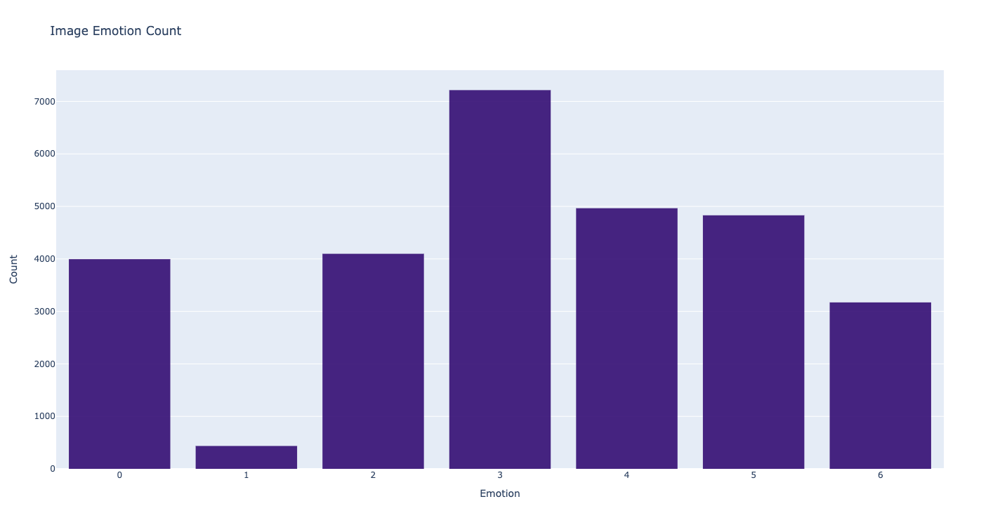

# Decription

__Team members__: Daria Diatlova, Eugene Sakhno

__Theme__: Image augmentation using image generation with GAN to improve multiclass emotion classification accuracy on images of minor classes and overall testing dataset.

__Dataset__: [FER13](https://datarepository.wolframcloud.com/resources/FER-2013) consists of 35,886 images. 

The task is multiclassification. Our hypothesis is that accuracy of a simple CNN model for image classification could be improved by generating more images and classes equalization.

### Plan: 

1. Explore:

	- state-of-art CNN models architecture that are used to solve multiclass emotion classification problems,

	- state-of-art GAN models architecture that are used for generating face images.

2. Implement a simple CNN model, train and analyze the results.

3. Augment data using GAN, analyze the results of CNN model trained on augmented dataset. 

4. Analyze how parameters and architecture of GAN affect CNN model accuracy. 

#Data overview
There are 7 image classes in the dataset that are encoded as following:

**Emotion** | Angry | Disgust | Fear | Happy | Neutral | Sad | Surprise
---|---|---|---|---|---|---|---
Id | 0| 1 | 2 | 3 | 4 | 5 | 6 

Classes are unbalanced and distributed as following:

# How to preprocess dataset
1. Download [`data.zip`](https://www.kaggle.com/msambare/fer2013?select=test), unarchive it and put all content in `data`
folder in the root of repository. Run [`make_csv.py`](make_csv.py) images to get `csv` filed with labels.There are 7 classes of emotions in the dataset, labels
   Output files will be saved to the `data` directory and would have 2 columns: `path` and `label`. 
   

